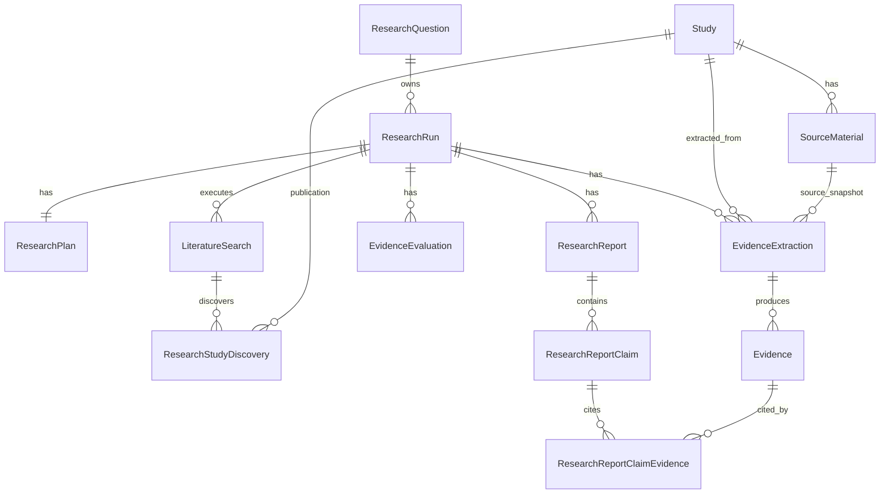
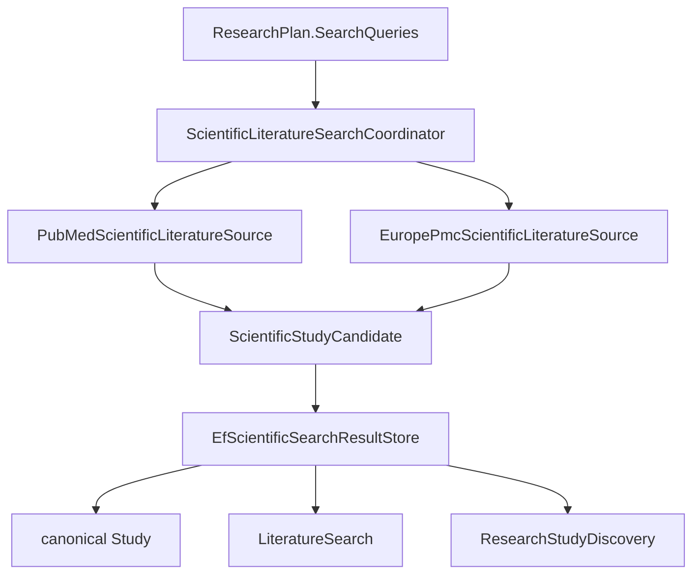

# MedResearch: обзор архитектуры

Этот документ объясняет MedResearch простым языком. Он не заменяет `ARCHITECTURE.md` и ADR, а помогает быстро понять, как система работает сейчас.

## Что вообще делает MedResearch?

MedResearch принимает научный вопрос, запускает фоновый исследовательский процесс, ищет публикации, сохраняет источники, извлекает из них проверяемые findings, оценивает доступную методологическую информацию и создает отчет с claims, которые ссылаются на реальные `Evidence` из текущего запуска.

Система не ставит диагнозы, не рекомендует лечение и не является врачебным советником. Ее цель ближе к evidence synthesis: собрать, ограничить, проверить и сделать трассируемым путь от вопроса до отчета.

```mermaid
flowchart TD
    A[HTTP POST /api/research] --> B[CreateResearchUseCase]
    B --> C[ResearchQuestion]
    B --> D[ResearchRun: Queued]
    C --> E[(PostgreSQL)]
    D --> E
    E --> F[BackgroundResearchWorker]
    F --> G[PostgreSQL claim + lease]
    G --> H[Planning]
    H --> I[Searching]
    I --> J[Source acquisition]
    J --> K[Extracting]
    K --> L[Evaluating]
    L --> M[EvidenceCorpus]
    M --> N[Quantitative read models]
    N --> O[Synthesizing]
    O --> P[ResearchReport]
    P --> Q[GET /api/research/{id}/report]
```

## Слои проекта

MedResearch - layered monolith. Это один deployable API, но код разделен по ответственностям.

| Проект | Что делает | Чего не должен делать |
| --- | --- | --- |
| `src/MedResearch.Domain` | Доменные сущности и инварианты: `ResearchRun`, `Study`, `Evidence`, `ResearchReport` | EF Core, HTTP, OpenAI, PubMed, PostgreSQL |
| `src/MedResearch.Application` | Use cases, pipeline orchestration, provider-neutral ports, validation of LLM/provider output | Конкретные HTTP DTO PubMed/Europe PMC/OpenAI, `DbContext`, SQL |
| `src/MedResearch.Infrastructure` | EF Core/PostgreSQL, hosted worker adapter, OpenAI adapter, PubMed, Europe PMC, source-material adapters | API contracts, business rules в endpoints |
| `src/MedResearch.Api` | Minimal API endpoints, Problem Details, health checks, DI composition root | Научная логика, прямые EF queries из endpoints |

Главная идея: Application говорит “мне нужен scientific literature source” или “структурный LLM client”, а Infrastructure решает, что это PubMed, Europe PMC или OpenAI.

## Жизненный цикл HTTP запроса

Пользователь отправляет:

```http
POST /api/research
Content-Type: application/json

{"question":"Does chronic sleep deprivation impair working memory in adults?"}
```

`Program.cs` вызывает `CreateResearchUseCase`. Use case создает:

- `ResearchQuestion`: текст вопроса и его identity;
- `ResearchRun`: один запуск обработки этого вопроса, начальный статус `Queued`.

API сразу возвращает `201 Created` и `researchRunId`. Он не ждет PubMed, Europe PMC, OpenAI или synthesis, потому что весь research pipeline может занять долго и может переживать рестарты процесса.

Потом клиент смотрит статус:

```http
GET /api/research/{researchRunId}
```

И когда отчет готов:

```http
GET /api/research/{researchRunId}/report
```

Если run найден, но report еще не создан, endpoint возвращает `409 Conflict`, а не придумывает частичный отчет.

## ResearchQuestion и ResearchRun

`ResearchQuestion` - это сам научный вопрос. `ResearchRun` - это одна попытка выполнить pipeline для этого вопроса.

Один вопрос может иметь несколько запусков:

```text
ResearchQuestion X
├─ ResearchRun A
└─ ResearchRun B
```

`Study` может быть глобально общей публикацией, но run-specific данные не должны смешиваться между runs:

- `ResearchPlan` принадлежит конкретному run;
- `LiteratureSearch` принадлежит конкретному run;
- `ResearchStudyDiscovery` принадлежит конкретному run/search;
- `EvidenceExtraction`, `Evidence`, `EvidenceEvaluation`, `ResearchReport` и report claims принадлежат конкретному run.

## Состояния ResearchRun

Основной путь:

```text
Queued -> Planning -> Searching -> Extracting -> Evaluating -> Synthesizing -> Completed
```

Терминальные состояния:

```text
Failed
Cancelled
```

`ResearchRun` в Domain не имеет произвольного публичного setter для статуса. Переходы выполняются методами вроде `StartSearching`, `StartExtraction`, `Complete`, `Fail`, `Cancel`. Если попытаться прыгнуть из `Queued` сразу в `Evaluating`, Domain выбросит ошибку.

## База данных крупными блоками



Самые важные таблицы:

| Entity | Смысл |
| --- | --- |
| `research_questions` | Исходный вопрос пользователя |
| `research_runs` | Выполнение pipeline, статус, lease metadata |
| `research_plans` | Проверенный план поиска от LLM |
| `studies` | Глобальная публикация, identity по PMID/PMCID/DOI |
| `literature_searches` | Один выполненный query против одного provider |
| `research_study_discoveries` | Этот search нашел этот Study |
| `source_materials` | Конкретный текстовый snapshot: abstract или structured full text |
| `evidence_extractions` | Попытка extraction для run/study/source/prompt |
| `evidence` | Grounded finding из source material |
| `evidence_evaluations` | Source-aware методологическая оценка study в run |
| `research_reports` | Итоговый отчет |
| `research_report_claims` | Claims отчета |
| `research_report_claim_evidence` | Claims -> Evidence citations |

## Study, SourceMaterial и Evidence

Эти три сущности легко спутать.

`Study` отвечает на вопрос: “что это за публикация?”

Пример: статья с PMID `123`, DOI `10.1000/example`, названием и журналом.

`SourceMaterial` отвечает на вопрос: “какой текст MedResearch использовал?”

Пример:

- abstract из PubMed/Europe PMC metadata;
- structured full text из Europe PMC `fullTextXML`;
- версия 1, SHA-256 content hash, provider, retrieval method, truncation flag.

`Evidence` отвечает на вопрос: “какой конкретный finding был извлечен из этого текста?”

Пример:

```text
Outcome: working memory accuracy
Result: sleep deprivation reduced accuracy
SupportingText: exact excerpt from SourceMaterial.Content
Direction: Negative
```

Completed `EvidenceExtraction` должен ссылаться на точный `SourceMaterialId`. Это нужно, чтобы через год можно было понять, из какого именно текста появился finding.

## Scientific retrieval и provenance

`Searching` не создает evidence. Он только выполняет search queries и нормализует metadata публикаций.



Один query против двух sources создает два `LiteratureSearch`:

```text
query: sleep deprivation working memory
├─ LiteratureSearch PubMed
│  └─ ResearchStudyDiscovery -> Study X
└─ LiteratureSearch EuropePmc
   └─ ResearchStudyDiscovery -> Study X
```

Ожидаемый результат:

- один canonical `Study X`;
- две provenance paths;
- один downstream work item для extraction в этом run.

Identity `Study` основана только на стабильных identifiers: normalized PMID, PMCID, DOI. Система не объединяет публикации по похожему title, авторам или году.

Если incoming candidate указывает PMID, который ведет к Study A, а DOI ведет к Study B, это hard identity conflict. MedResearch не выбирает “победителя”, не merge-ит записи и не перезаписывает metadata; он логирует bounded diagnostic, пропускает ambiguous discovery и продолжает остальные результаты.

## Source acquisition

Перед extraction система пытается получить лучший доступный текст для каждого distinct Study в текущем run.

Порядок примерно такой:

1. Сохранить abstract как `SourceMaterial`, если он есть.
2. Если включен Europe PMC full text и есть PMCID, попробовать официальный `fullTextXML` endpoint.
3. Выбрать лучший current source для extraction: structured full text предпочтительнее abstract, затем учитываются truncation, version, provider, id.
4. Если текста нет, записать skipped extraction с `NoExtractableText`, не вызывать LLM.

MedResearch не скачивает произвольные PDF, не scrape-ит HTML, не обходит paywall и не ходит по publisher links.

## LLM trust boundaries

LLM output всегда считается недоверенным. Даже strict JSON Schema не заменяет Application validation.

| Стадия | Что получает LLM | Что валидирует C# |
| --- | --- | --- |
| Planning | Текущий вопрос и planning instructions | original question, query bounds, no DOI/PMID invention, allowed study types |
| Extraction | Текущий вопрос, bounded plan context, один Study и один SourceMaterial | required fields, supported directions/designs, supporting text grounded in source, numeric values grounded in source |
| Evaluation | Study metadata, source scope, extraction provenance, grounded evidence | supported categories, bounded text, no source absence as flaw, categorical semantics |
| Synthesis | Current-run corpus, selected EvidenceIds, evaluations, limitations, quantitative context | claims cite supplied same-run EvidenceIds, no model-supplied PMID/DOI/StudyId, direction compatibility |

Модель не является источником citation identifiers. `GET /report` строит PMID/PMCID/DOI из persisted `Study`, а не из ответа LLM.

## EvidenceCorpus

Перед synthesis `EvidenceCorpusBuilder` загружает current-run graph и проверяет его как trust boundary:

- snapshot принадлежит ожидаемому `ResearchRun`;
- `Study` snapshots уникальны;
- `EvidenceExtraction` принадлежит current run и known Study;
- completed extraction имеет grounded source lineage;
- `Evidence` ссылается на completed grounded extraction;
- `EvidenceExtraction.SourceMaterialId` указывает на source того же Study;
- `EvidenceEvaluation.EvidenceIds` входят в corpus;
- search provenance принадлежит current run.

Только после этого `SynthesisContextBuilder` ограничивает corpus по настройкам `Synthesis:*` и добавляет deterministic summaries.

## Quantitative block M15-M22

Количественный слой сейчас является Application read model поверх validated EvidenceCorpus. Он не создает persisted meta-analysis таблицу. M22 добавляет random-effects view рядом с common/fixed-effect view, а не заменяет его.

| Milestone | Что добавлено | Чего нет |
| --- | --- | --- |
| M15 | `QuantitativeEvidenceAssessor`: eligibility, effect-measure classification, compatibility groups | broad meta-analysis result |
| M17 | `FixedEffectQuantitativeStatisticalSynthesizer`: inverse-variance fixed-effect OR/RR/HR groups | random effects, forest plots, MD/SMD/correlation pooling |
| M18 | Cochran's Q, df, I-squared diagnostics over same fixed-effect contributions | model selection, causal heterogeneity explanation |
| M19 | REML tau-squared estimator foundation | random-effects pooling was deferred until M22 |
| M22 | REML random-effects inverse-variance pooled estimate with Wald CI | HKSJ, prediction intervals, tau-squared CI, automatic model selection |

LLM может описывать supplied deterministic quantitative values, но не рассчитывает pooled estimates, random-effects weights, tau-squared, confidence intervals и не изменяет их.

## Worker, leases и recovery

Фоновый worker - `BackgroundResearchWorker` в Infrastructure. Он создает scope, берет `ResearchRunProcessor` и пытается claim-нуть одну работу.

Claim/reclaim выполняется в PostgreSQL через atomic SQL:

- выбирается queued или expired recoverable run;
- используется `FOR UPDATE SKIP LOCKED`;
- queued run переводится в `Planning`;
- устанавливаются `processing_lease_owner`, timestamps и `processing_lease_version + 1`;
- возвращается claimed run.

Recoverable statuses:

```text
Planning, Searching, Extracting, Evaluating, Synthesizing
```

Не reclaim-ятся:

```text
Completed, Failed, Cancelled
```

Во время долгой стадии processor запускает heartbeat loop. Heartbeat и save-progress требуют:

```text
id == run id
processing_lease_owner == worker id
processing_lease_version == claimed lease version
```

Если старый worker проснулся после expiry, но другой worker уже reclaim-нул run и увеличил lease version, старый worker не сможет сохранить progress/failure поверх нового владельца.

## Ошибки и cancellation

Если стадия падает обычной ошибкой, worker логирует полную ошибку и пытается записать `Failed` с безопасной причиной `Research processing failed.`. Детали exception не отдаются API клиенту.

Если host shutting down и приходит cancellation, это не считается научной ошибкой. Worker пытается release lease; если не успел, lease истечет, и другой worker сможет reclaim-нуть run позже.

Если provider вернул zero results, это не failure. Это успешный search с `result_count = 0` и нулем discovered studies.

## Health checks

API exposes:

- `/health`: стандартные ASP.NET Core checks;
- `/health/live`: liveness без PostgreSQL/OpenAI/PubMed/Europe PMC;
- `/health/ready`: readiness с PostgreSQL DbContext check.

Health checks не вызывают OpenAI, PubMed или Europe PMC.

## Конфигурация

Основные секции:

| Section | Назначение |
| --- | --- |
| `ConnectionStrings:MedResearch` | PostgreSQL connection string |
| `Database:ApplyMigrationsOnStartup` | local compose convenience migrations |
| `ResearchProcessing` | worker enabled/idle delay/lease/heartbeat |
| `ResearchPlanning` | max search queries |
| `AI` | OpenAI provider/base/model/key/timeout/output tokens |
| `PubMed` | enabled/base/tool/email/api key/results/rate/batch/retry |
| `EuropePmc` | enabled/base/results/page/rate/retry |
| `SourceAcquisition` | source acquisition enabled/max studies/content/preference |
| `EuropePmcFullText` | fullTextXML enabled/content/timeout/retry |
| `EvidenceExtraction` | max studies per run |
| `EvidenceEvaluation` | max studies per run |
| `Synthesis` | max studies/evidence/claims |
| `QuantitativeSynthesis` | confidence level/minimum unique studies |

`.env.example` содержит development-only placeholders. Реальные ключи не коммитятся.

## Тестовая архитектура

| Test project | Что проверяет |
| --- | --- |
| `tests/MedResearch.Domain.Tests` | Domain invariants and lifecycle |
| `tests/MedResearch.Application.Tests` | Use cases, validators, pipeline services, fake LLM, quantitative code |
| `tests/MedResearch.Infrastructure.Tests` | Fake HTTP adapters, parsing, request/retry/rate/normalization behavior |
| `tests/MedResearch.IntegrationTests` | API factory tests and PostgreSQL/Testcontainers persistence/concurrency graph tests |

Normal local tests and CI do not call live OpenAI, PubMed, Europe PMC, or full-text endpoints. Optional live projects are outside `MedResearch.slnx` and require explicit environment variables.

CI is authoritative for PostgreSQL when local Docker Desktop is unavailable. In CI, `MEDRESEARCH_REQUIRE_DOCKER_TESTS=true` makes Docker-required tests fail instead of silently skipping.

## Где искать код

| Вопрос | Файлы |
| --- | --- |
| HTTP endpoints | `src/MedResearch.Api/Program.cs`, `src/MedResearch.Api/Research/ResearchApiModels.cs` |
| Создание run | `src/MedResearch.Application/Research/CreateResearchUseCase.cs`, `src/MedResearch.Infrastructure/Research/EfResearchStore.cs` |
| Worker и leases | `src/MedResearch.Infrastructure/Research/Processing/BackgroundResearchWorker.cs`, `src/MedResearch.Application/Research/Processing/ResearchRunProcessor.cs`, `src/MedResearch.Infrastructure/Research/Processing/PostgreSqlResearchRunQueue.cs` |
| Stage orchestration | `src/MedResearch.Application/Research/Processing/ScientificResearchStageExecutor.cs` |
| Search | `src/MedResearch.Application/Research/Literature`, `src/MedResearch.Infrastructure/Literature` |
| Source material | `src/MedResearch.Application/Research/SourceMaterials`, `src/MedResearch.Infrastructure/SourceMaterials` |
| Extraction | `src/MedResearch.Application/Research/Extraction`, `src/MedResearch.Infrastructure/Extraction/Persistence` |
| Evaluation | `src/MedResearch.Application/Research/Evaluation`, `src/MedResearch.Infrastructure/Evaluation/Persistence` |
| Synthesis/report | `src/MedResearch.Application/Research/Synthesis`, `src/MedResearch.Infrastructure/Synthesis/Persistence` |
| Quantitative | `src/MedResearch.Application/Research/Quantitative` |
| EF mappings | `src/MedResearch.Infrastructure/Persistence/Configurations` |
| Migrations | `src/MedResearch.Infrastructure/Persistence/Migrations` |

## Пять критических инвариантов

1. `Evidence`, `EvidenceExtraction`, `EvidenceEvaluation` и `ResearchReport` run-scoped; cross-run citation запрещена.
2. `Study` global, но provenance сохраняется через per-source/per-query `LiteratureSearch` и `ResearchStudyDiscovery`.
3. LLM output недоверенный; citation authority, numeric transformations and synthesis validation live in C# and persistence.
4. Completed `Evidence` должен иметь lineage: `Evidence -> EvidenceExtraction -> SourceMaterial -> Study`.
5. Worker lease owner + lease version fencing не должны позволять stale worker перезаписать новый progress.

## Что пока не реализовано

- diagnosis/treatment advice;
- RAG/vector search/embeddings;
- third scientific provider;
- arbitrary PDF/HTML scraping;
- formal GRADE/RoB frameworks;
- semantic outcome harmonization;
- cohort-overlap detection;
- HKSJ inference, prediction intervals, tau-squared confidence intervals, automatic model selection, and persisted quantitative result artifacts;
- persisted quantitative result artifact;
- production migration strategy;
- distributed provider rate limiter.

## Двухминутное объяснение проекта

MedResearch - это .NET layered monolith для evidence synthesis. API принимает research question и сразу возвращает queued `ResearchRun`. Hosted worker claim-ит run в PostgreSQL через lease, проходит stages Planning, Searching, Source acquisition, Extraction, Evaluation, Synthesis и пишет отчет. PubMed и Europe PMC дают provider-neutral study candidates, PostgreSQL решает canonical `Study` по PMID/PMCID/DOI и сохраняет отдельную provenance для каждого source/query. LLM используется только за trust boundary: план, extraction, evaluation, synthesis валидируются C# кодом. Claims в отчете могут ссылаться только на current-run `Evidence`, а citation metadata берется из persisted `Study`, не из модели. Количественный слой сейчас deterministic read model: eligibility, fixed/common-effect OR/RR/HR pooling, Q/I², REML tau² foundation и REML random-effects Wald pooling, но без HKSJ, prediction interval или автоматического выбора модели.
