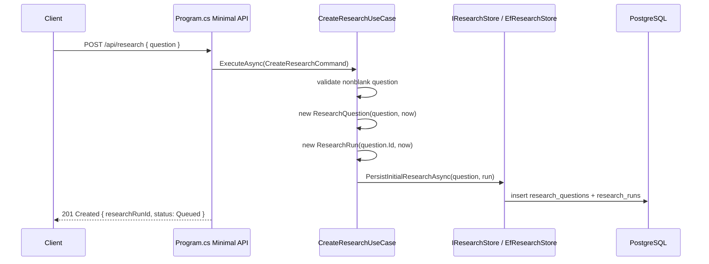
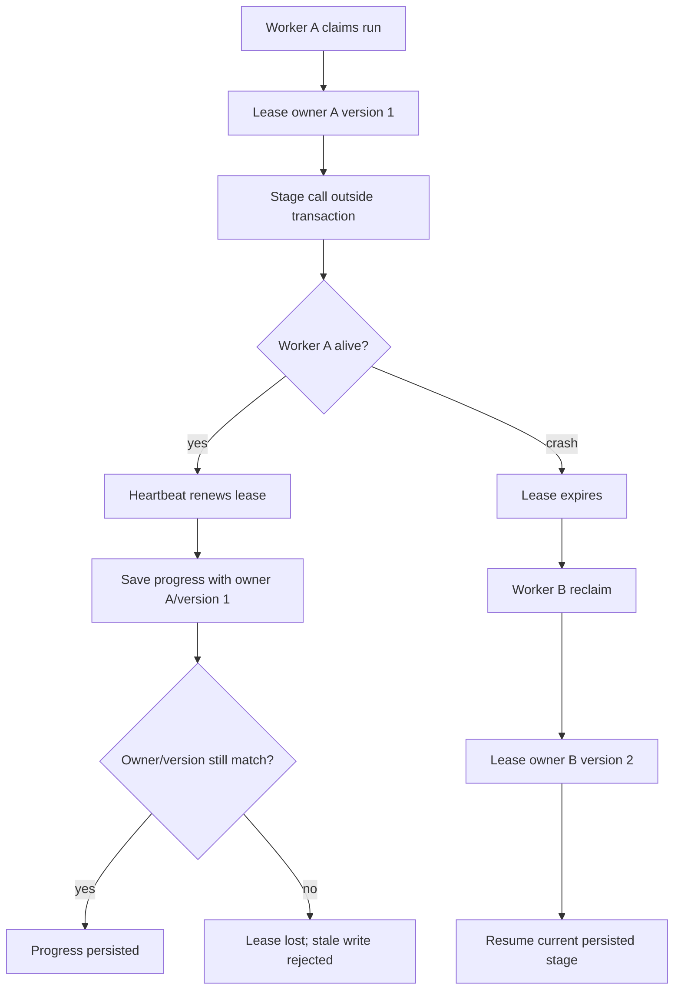

# Request lifecycle

This document traces the actual MedResearch request path through code. It is intentionally more code-oriented than `docs/architecture-overview.md`.

## 1. Submit a research question

Endpoint:

```text
POST /api/research
```

Primary files:

- `src/MedResearch.Api/Program.cs`
- `src/MedResearch.Api/Research/ResearchApiModels.cs`
- `src/MedResearch.Application/Research/CreateResearchUseCase.cs`
- `src/MedResearch.Infrastructure/Research/EfResearchStore.cs`

Flow:



Important behavior:

- The API does not call OpenAI, PubMed, Europe PMC, extraction, evaluation, or synthesis.
- A `ResearchRun` is created as `Queued`.
- Background processing is asynchronous and durable through PostgreSQL.

## 2. Observe run status

Endpoint:

```text
GET /api/research/{researchRunId}
```

Primary files:

- `src/MedResearch.Api/Program.cs`
- `src/MedResearch.Application/Research/GetResearchUseCase.cs`
- `src/MedResearch.Infrastructure/Research/EfResearchStore.cs`

The endpoint returns a read projection containing:

- run id;
- original question;
- status;
- created/started/completed timestamps;
- safe failure reason if failed.

Unknown run id returns `404`.

## 3. Worker startup and polling

Primary files:

- `src/MedResearch.Infrastructure/DependencyInjection/ServiceCollectionExtensions.cs`
- `src/MedResearch.Infrastructure/Research/Processing/BackgroundResearchWorker.cs`
- `src/MedResearch.Application/Research/Processing/ResearchRunProcessor.cs`

`AddInfrastructure(configuration)` registers `BackgroundResearchWorker` only when `ResearchProcessing:Enabled` is true.

The worker:

1. Builds a `WorkerId` from machine name and random GUID.
2. Creates a DI scope per loop iteration.
3. Resolves `ResearchRunProcessor`.
4. Calls `ProcessNextQueuedRunAsync(workerId, leaseDuration, heartbeatInterval, stoppingToken)`.
5. Sleeps for `ResearchProcessing:IdleDelayMilliseconds` only when no work was claimed.

## 4. Claim or reclaim a run

Primary file:

- `src/MedResearch.Infrastructure/Research/Processing/PostgreSqlResearchRunQueue.cs`

The queue uses one PostgreSQL statement inside a `ReadCommitted` transaction:

```text
WITH candidate AS (
  SELECT id, status
  FROM research_runs
  WHERE status = Queued
     OR status in active pipeline stages with expired/missing lease
  ORDER BY queued first, created_at, id
  FOR UPDATE SKIP LOCKED
  LIMIT 1
)
UPDATE research_runs
SET status = Planning when queued,
    started_at = COALESCE(started_at, claimed_at),
    processing_lease_owner = worker_id,
    processing_lease_acquired_at = claimed_at,
    processing_lease_expires_at = claimed_at + lease_duration,
    last_heartbeat_at = claimed_at,
    processing_lease_version = processing_lease_version + 1
RETURNING run + question text + reclaimed flag
```

Recoverable statuses:

```text
Planning, Searching, Extracting, Evaluating, Synthesizing
```

Not recoverable:

```text
Completed, Failed, Cancelled
```

Claim result is `ClaimedResearchRun`, containing run, question text, worker id, lease version, lease expiry, and whether it was reclaimed.

## 5. Stage processing loop

Primary files:

- `src/MedResearch.Application/Research/Processing/ResearchRunProcessor.cs`
- `src/MedResearch.Application/Research/Processing/ScientificResearchStageExecutor.cs`

Loop:

```text
while status is Planning/Search/Extract/Evaluate/Synthesize:
    renew lease
    execute current stage with heartbeat loop
    advance domain status
    save progress with owner+leaseVersion fence
```

`SaveProgressAsync` updates status only if the row still matches:

```text
id = claimed run id
processing_lease_owner = claimed worker id
processing_lease_version = claimed lease version
```

If the update returns no row, Application throws `ResearchRunLeaseLostException`. This means a newer owner probably reclaimed the run or terminal state changed.

## 6. Planning

Primary files:

- `src/MedResearch.Application/Research/Planning/ResearchPlanner.cs`
- `src/MedResearch.Application/Research/Planning/ResearchPlannerPrompt.cs`
- `src/MedResearch.Application/Research/Planning/ResearchPlanValidator.cs`
- `src/MedResearch.Infrastructure/Planning/Persistence/EfResearchPlanStore.cs`
- `src/MedResearch.Infrastructure/Ai/OpenAI/OpenAIStructuredLlmClient.cs`

Input:

- `ResearchRunId`
- `ResearchQuestionId`
- authoritative question text

Output:

- one accepted `ResearchPlan`

Persistence:

- `research_plans`

Important validation:

- model `originalQuestion` must match stored question after normalization;
- search query count and length are bounded;
- duplicate queries are removed;
- stable identifiers such as DOI/PMID in planner output are rejected;
- preferred study types must be from supported labels.

Failure:

- malformed/invalid LLM output fails the run through safe worker failure path;
- missing OpenAI config fails when provider is invoked, not at health check time.

## 7. Searching

Primary files:

- `src/MedResearch.Application/Research/Literature/ScientificLiteratureSearchCoordinator.cs`
- `src/MedResearch.Application/Research/Literature/ScientificSearchContracts.cs`
- `src/MedResearch.Infrastructure/Literature/PubMed/PubMedScientificLiteratureSource.cs`
- `src/MedResearch.Infrastructure/Literature/EuropePmc/EuropePmcScientificLiteratureSource.cs`
- `src/MedResearch.Infrastructure/Literature/Persistence/EfScientificSearchResultStore.cs`
- `src/MedResearch.Infrastructure/Literature/Identity/ScientificIdentifierNormalizer.cs`

Input:

- accepted plan search queries
- enabled `IScientificLiteratureSource` implementations

Output:

- provider-neutral `ScientificStudyCandidate[]`
- `Study`
- `LiteratureSearch`
- `ResearchStudyDiscovery`

Flow:

```text
ResearchPlan.SearchQueries
  -> ScientificLiteratureSearchCoordinator
  -> each enabled source per query
  -> ScientificStudyCandidate[]
  -> EfScientificSearchResultStore
  -> normalized PMID/PMCID/DOI identity resolution
  -> canonical Study
  -> LiteratureSearch row
  -> ResearchStudyDiscovery row per search/study
```

Important behavior:

- One query against two sources creates two search executions.
- Zero results are persisted as a successful `LiteratureSearch` with zero counts.
- A query only fails the stage if every enabled source fails for that query.
- Provider DTOs stay in Infrastructure.
- Study merge is deterministic over PMID/PMCID/DOI only.
- PostgreSQL advisory locks serialize concurrent identity resolution by stable identifiers.

## 8. Source acquisition

Primary files:

- `src/MedResearch.Application/Research/SourceMaterials/SourceMaterialAcquirer.cs`
- `src/MedResearch.Infrastructure/SourceMaterials/Persistence/EfSourceMaterialStore.cs`
- `src/MedResearch.Infrastructure/SourceMaterials/EuropePmc/EuropePmcFullTextSourceMaterialProvider.cs`

Input:

- distinct discovered `Study` rows for current run

Output:

- current `SourceMaterial` snapshots

Behavior:

- search metadata abstract can be saved as `SourceMaterialType.Abstract`;
- Europe PMC `fullTextXML` can save `SourceMaterialType.StructuredFullText` when available;
- same content hash reuses existing version;
- changed content creates a new version and marks older current versions not current;
- source acquisition failures are logged per provider/study and do not automatically fail the whole run if other material exists.

## 9. Extracting

Primary files:

- `src/MedResearch.Application/Research/Processing/ScientificResearchStageExecutor.cs`
- `src/MedResearch.Infrastructure/Extraction/Persistence/EfEvidenceExtractionStore.cs`
- `src/MedResearch.Application/Research/Extraction/EvidenceExtractor.cs`
- `src/MedResearch.Application/Research/Extraction/EvidenceExtractionDraftValidator.cs`
- `src/MedResearch.Application/Research/Extraction/EvidenceGroundingValidator.cs`
- `src/MedResearch.Application/Research/Extraction/EvidenceNumericGroundingValidator.cs`

Input:

- current-run distinct discovered studies;
- best current source material per study;
- prompt version `evidence-extractor-v1`.

Output:

- `EvidenceExtraction`
- zero or more `Evidence`

Idempotency:

- existing extraction for run + study + selected source material + prompt version is skipped.

Validation:

- required outcome/result/supporting text;
- supporting text must be contained in selected source after normalization;
- numeric values are persisted only if grounded in source text;
- unsupported study-design labels are rejected.

Failure:

- no source text creates skipped extraction with `NoExtractableText` and no LLM call;
- validation/provider failures fail the run through worker safe failure path.

## 10. Evaluating

Primary files:

- `src/MedResearch.Infrastructure/Evaluation/Persistence/EfEvidenceEvaluationStore.cs`
- `src/MedResearch.Application/Research/Evaluation/EvidenceEvaluator.cs`
- `src/MedResearch.Application/Research/Evaluation/EvidenceEvaluationSignalBuilder.cs`
- `src/MedResearch.Application/Research/Evaluation/EvidenceEvaluationDraftValidator.cs`

Input:

- one study context;
- study metadata;
- extraction provenance;
- current-run grounded evidence;
- source scope.

Output:

- one `EvidenceEvaluation` per run/study/prompt version.

Important behavior:

- study with no extracted evidence is recorded as skipped with `NoExtractedEvidence` and no LLM call;
- abstract-only source limitations remain `Unknown` or `InsufficientSource`, not negative quality judgments;
- evaluation is internal categorical assessment, not formal GRADE/RoB.

## 11. EvidenceCorpus and quantitative read models

Primary files:

- `src/MedResearch.Application/Research/Synthesis/EvidenceCorpusBuilder.cs`
- `src/MedResearch.Application/Research/Synthesis/SynthesisContextBuilder.cs`
- `src/MedResearch.Infrastructure/Synthesis/Persistence/EfResearchSynthesisStore.cs`
- `src/MedResearch.Application/Research/Quantitative/QuantitativeEvidenceAssessor.cs`
- `src/MedResearch.Application/Research/Quantitative/FixedEffectQuantitativeStatisticalSynthesizer.cs`
- `src/MedResearch.Application/Research/Quantitative/HeterogeneityDiagnosticsCalculator.cs`
- `src/MedResearch.Application/Research/Quantitative/RestrictedMaximumLikelihoodTauSquaredEstimator.cs`

Input:

- persisted current-run graph

Output:

- in-memory `EvidenceCorpus`
- bounded `SynthesisContext`
- transient quantitative synthesis contexts when eligible

Validation:

- no cross-run evidence;
- evidence references completed grounded extraction;
- extraction source material belongs to same study;
- evaluation evidence ids are in corpus;
- search provenance belongs to current run.

Quantitative behavior:

- M15 determines eligibility and compatible groups;
- M17 computes fixed-effect inverse-variance OR/RR/HR results;
- M18 adds Q/df/I-squared diagnostics;
- M19 adds REML tau-squared foundation;
- no random-effects pooled estimate is produced.

## 12. Synthesizing

Primary files:

- `src/MedResearch.Application/Research/Synthesis/ResearchSynthesizer.cs`
- `src/MedResearch.Application/Research/Synthesis/ResearchSynthesisPrompt.cs`
- `src/MedResearch.Application/Research/Synthesis/ResearchReportDraftValidator.cs`
- `src/MedResearch.Infrastructure/Synthesis/Persistence/EfResearchSynthesisStore.cs`

Input:

- bounded `SynthesisContext`

Output:

- `ResearchReport`
- `ResearchReportClaim`
- `ResearchReportClaimEvidence`

Important behavior:

- if there is no validated evidence, Application creates `InsufficientEvidence` report without an LLM call;
- completed reports require evidence-supported claims and a conclusion claim;
- every claim must cite supplied current-run `EvidenceId` values;
- model-supplied PMID/DOI/StudyId values are rejected;
- claim direction must match cited evidence direction semantics;
- report persistence is idempotent by run + prompt version.

## 13. Complete the run

After `Synthesizing` stage succeeds, `ResearchRunProcessor.AdvanceAfterCurrentStage` calls `run.Complete(now)` and persists progress.

Completion:

- status becomes `Completed`;
- `completed_at` is set;
- active lease metadata is cleared;
- `processing_lease_version` is preserved as historical fencing metadata.

## 14. Read the report

Endpoint:

```text
GET /api/research/{researchRunId}/report
```

Primary files:

- `src/MedResearch.Api/Program.cs`
- `src/MedResearch.Application/Research/Synthesis/GetResearchReportUseCase.cs`
- `src/MedResearch.Infrastructure/Synthesis/Persistence/EfResearchSynthesisStore.cs`

Read projection joins:

```text
ResearchReport
  -> ResearchReportClaim
  -> ResearchReportClaimEvidence
  -> Evidence
  -> Study
```

The API response exposes citation metadata from persisted `Study`, not from LLM draft output.

## Stage table

| Stage | Input | Output | Persistence | Main class | Failure effect |
| --- | --- | --- | --- | --- | --- |
| Create | HTTP question | queued run id | `research_questions`, `research_runs` | `CreateResearchUseCase` | `400` for invalid question |
| Claim | queued/expired run | leased active run | `research_runs` lease/status | `PostgreSqlResearchRunQueue` | no work or lease lost |
| Planning | question | accepted plan | `research_plans` | `ResearchPlanner` | run `Failed` |
| Searching | plan queries | studies/search provenance | `studies`, `literature_searches`, `research_study_discoveries` | `ScientificLiteratureSearchCoordinator` | run `Failed` only if every enabled source fails for a query |
| Source acquisition | discovered studies | source snapshots | `source_materials` | `SourceMaterialAcquirer` | provider failures logged; no text leads to skipped extraction |
| Extracting | source material | grounded findings | `evidence_extractions`, `evidence` | `EvidenceExtractor` | run `Failed` for invalid/provider output |
| Evaluating | evidence + study | methodology categories | `evidence_evaluations` | `EvidenceEvaluator` | run `Failed` for invalid/provider output |
| Corpus | persisted graph | validated read model | none | `EvidenceCorpusBuilder` | run `Failed` if graph invariant broken |
| Quantitative | evidence corpus | transient stats | none | quantitative Application services | rejected groups remain explicit |
| Synthesizing | bounded context | report/claims/citations | `research_reports`, `research_report_claims`, `research_report_claim_evidence` | `ResearchSynthesizer` | run `Failed` for invalid/provider output |
| Complete | synthesized run | terminal run | `research_runs` | `ResearchRunProcessor` | lease lost prevents stale save |

## Failure and recovery trace



## Endpoint outcomes

| Endpoint | Successful result | Not-ready/missing behavior |
| --- | --- | --- |
| `POST /api/research` | `201 Created` with run id | `400` for invalid question |
| `GET /api/research/{id}` | `200 OK` with status | `404` unknown run |
| `GET /api/research/{id}/report` | `200 OK` report | `404` unknown run; `409` report not ready |
| `/health/live` | liveness only | does not depend on database or external providers |
| `/health/ready` | PostgreSQL-ready | fails if configured PostgreSQL is unavailable |
